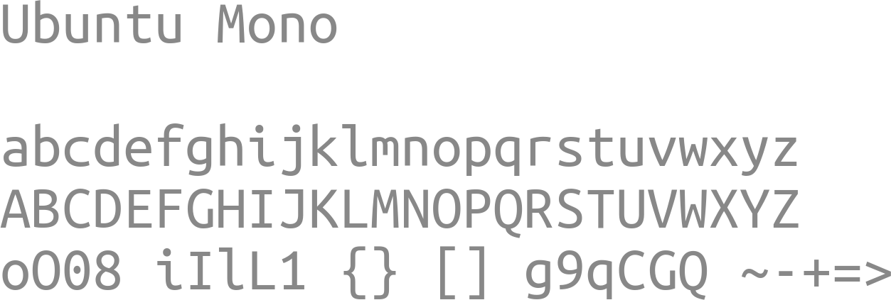

<h1> RQT2 Components </h1>

Sistema de diseño y libería de componentes base para **[RQT2](https://github.com/RQT2)**. Contine los recursos y estilos compartidos necesariso para todo el front-end de la IDE.

> [!CAUTION]
> Al modificar un recurso aquí, los cambios se reflejan en todo el proyecto.

## Contenido

```text
./
├── assets/
│   ├── branding/       # Logo
│   ├── icons/          # Iconos de acciones
│   └── fonts/          # Archivos de fuentes
├── styles/
│   ├── themes/         # Archivos .qss
│   └── palette.json    # Definición de colores
├── releases/           # Capturas de pantalla e imágenes
└── README.md
```

## Logo

`./assets/branding`


---
---
---
---
---

### Archivos

* `logo.`, `template.svg`: Archivos base para modificación.
* `logo-main-.`: Isotipos SVG generados a partir de `template.svg` para iconos medianos y grandes.
* `symbolic-.`: Isotipos SVG generados a partir de `template.svg` para iconos representativos/pequeños.
* `icon-`: Iconos PNG generados a partir de `logo-main-.` y `symbolic-.`.

## Paleta de colores

### Tema claro

| Rol        | Color |
| :----------|-------|
|Fondo       | `#ffffff`|
|Primer plano| `#000000`|
|Azul        | `#0090ff`|
|Verde       | `#068989`|
|Purpura     | `#c60184`|
|Rojo        | `#ff4f5e`|
|Naranja     | `#e5a436`|

### Tema oscuro

| Rol        | Color |
| :----------|-------|
|Fondo       | `#000000`|
|Primer plano| `#ffffff`|
|Azul        | `#0090ff`|
|Verde       | `#3fe1b0`|
|Purpura     | `#fe4aa3`|
|Rojo        | `#ff4f5e`|
|Naranja     | `#ffbd4f`|

## Estilos y Temas

`./styles`

* **palette.json**: Diccionario main de colores para uso en `Qt`>`Pyside6`.
* **themes/**: Temas de colores `.qss`.

## Tipografía

`./assets/fonts`





| Fuente | Uso |
| :----- | --- |
| **Nunito Sans** | Interfaz (UI). |
| **Ubuntu Mono** | Código/Terminal. |
| **Nerd Fonts** | Iconos. |

## Iconos

`./assets/branding`

Iconos simbolicos: En combinación con [Nerd Fonts](https://www.nerdfonts.com/cheat-sheet) son usados para las acciones de la IDE.

| Icono | Nombre | Rol |
| :-----|--------|-----|
|  | `3d` | Acceso directo a RViz. |
|  | `emulator` | Acceso directo a `gz sim` (Simulador de Gazebo). |
|  | `widgets` | Acceso directo a rqt. |
|  | `daemon` | Reinicia el proceso de ROS2. |
|  | `bug` | Obtener backtrace de nodos usando `gdb`. |
|  | `compile` | Crea el espacio de trabajo de ROS2: Primero resuelve dependencias con `rosdep install` para construir el espacio de trabajo con `colcon build` y finalmente cargar el overlay generado. |
|  | `clean` | Elimina los directorios `build`, `install` y `log` creados por `colcon build`. |
|  | `load` | Carga el overlay `install/local_setup.$SHELL` generado por `colcon build`. |
|  | `settings` | Abre un fomulario para editar archivos de configuración de paquetes de ROS2 como **package.xml** o **CMakeList.txt**. |
|  | `list` | Abre la ventana de nodos y topicos en ejecución. |
|  | `launch` | Abre la ventana de nodos y lanzadores disponibles. |
|  | `run` | Ejecuta nodos o lanzadores. |
|  | `stop` | Detiene nodos o lanzadores en ejecución. |
|  | `synchronize` | Se conecta a topicos como publicador o subscriptor. |
|  | `unsynchronize` | Se desconecta de topicos anteriormente conectado desde la IDE. |
|  | `new` | Crea elementos nuevos (paquetes/lanzadores/nodos). |
|  | `nodes` | Abre ventana `node-graph` (parecido a `rqt_graph`). |
|  | `params` | Abre un fomulario para editar parametros de nodos (`ros2 param set`). |
|  | `record` | Graba los datos publicados sobre un topico con `ros2 bag`. |
|  | `play` | Reproduce los datos grabados de un topico con `ros2 bag`. |
|  | `ssh` | Abre un formulario para establecer una conexión SSH. |
|  | `teleop` | Abre un formulario para enviar instrucciones de control manual con `ros2 teleop`. |
|  | `close` | Window button: Cerrar ventana. |
|  | `maximize` | Window button: Maximizar ventana. |
|  | `minimize` | Window button: Minimizar ventana. |
|  | `restore` | Window button: Restaura el tamaño de la ventana. |
|  | `split` | Window button: Abre una terminal. |
|  | `tab` | Window button: Cierra la terminal. |
